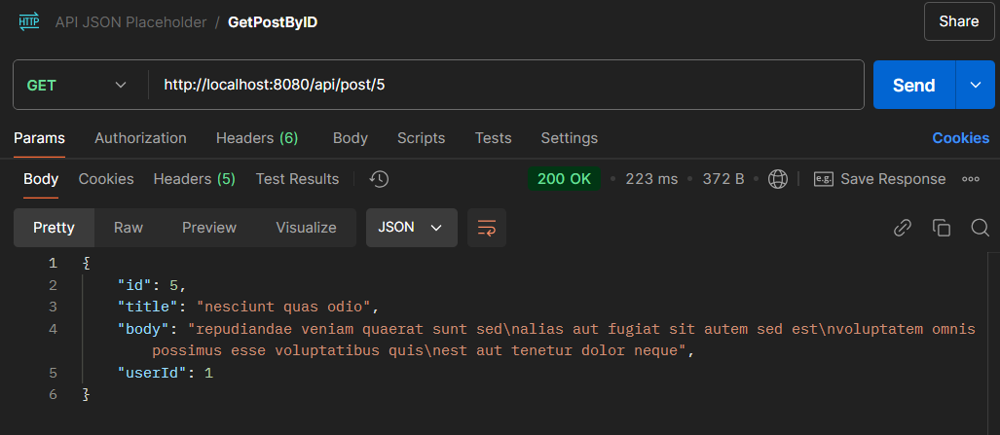
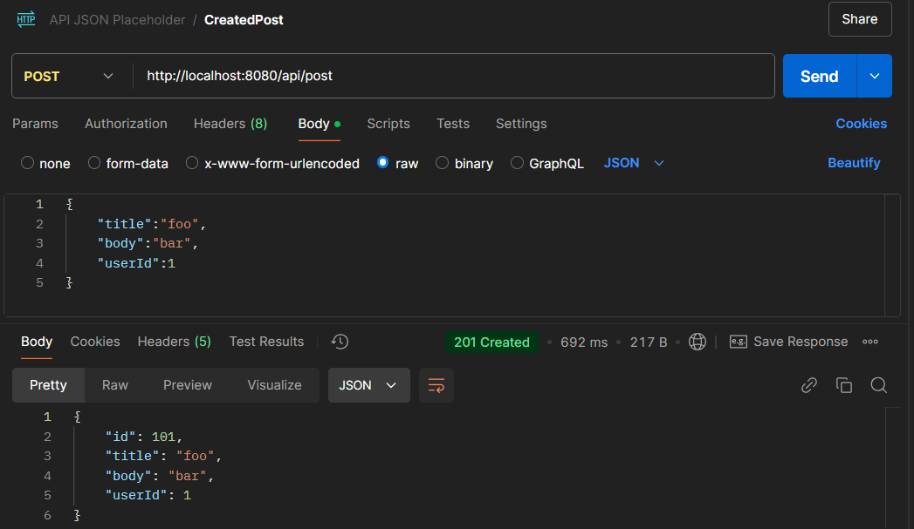
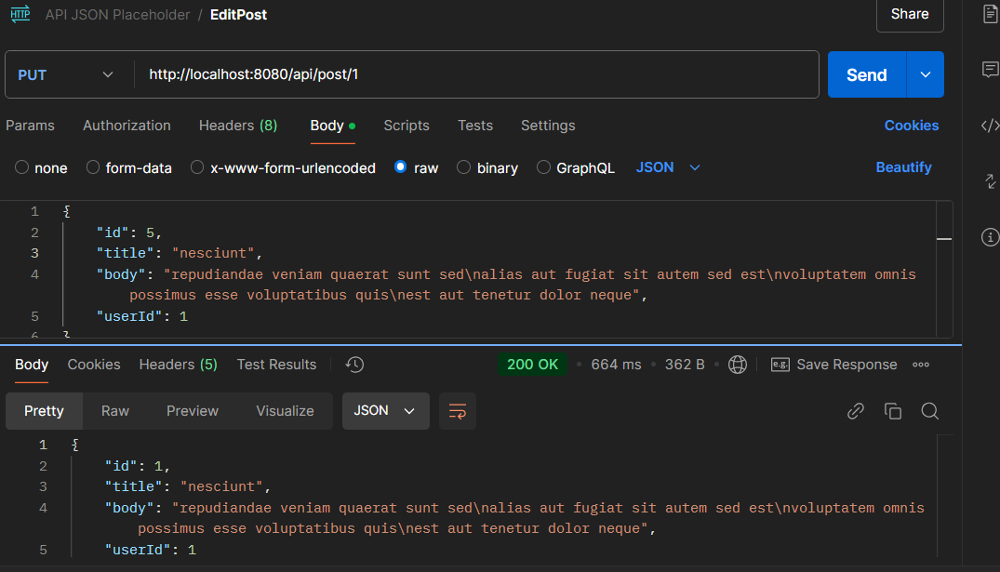
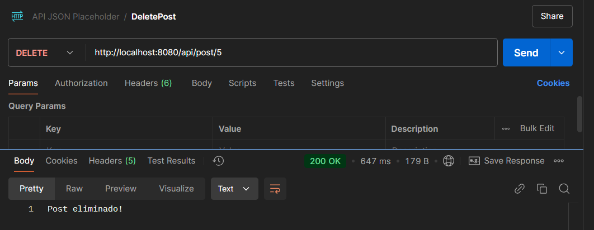

# CONSUMO-API 🌟
Consumo de la API **JSONPlaceholder** utilizando **RestTemplate** ✨☁️💻

## 🌐 Enlace a la API

Puedes acceder a la documentación de la API **[aquí](https://jsonplaceholder.typicode.com/)**. 🚀

## Capturas de pantalla

### 1️⃣ **GET by ID** 
Aquí está la captura de cómo se hace la solicitud **GET** por ID:  

### 2️⃣ **Created Post**  
¡Mira cómo se crea un nuevo post!  

### 3️⃣ **Edit Post**  
Aquí se edita un post que ya existe:  

### 4️⃣ **Delete Post**  
Y así es como se elimina un post:  

---

¡Espero que te haya gustado! 🌸💖 Si tienes alguna pregunta, no dudes en escribirme. 📝😊
